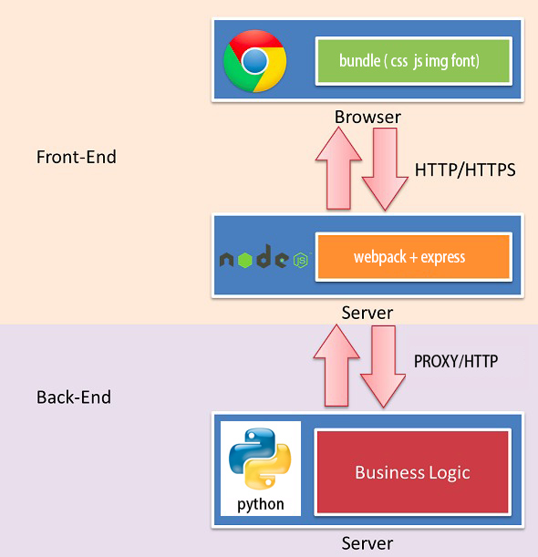

# 基于webpack的前后端分离开发环境实战


##背景

随着互联网应用工程规模的日益复杂化和精细化，我们在开发一个标准web应用的早已开始告别单干模式，为了提升开发效率，前后端分离的需求越来越被重视，前端负责展现/交互逻辑，后端负责业务/数据接口，基本上也成为了我们日常项目分工中的标配，但是前后端分离一直以来都是一个工程概念，每个团队在实现工程中都会基于自身的技术栈选择和开发环境进行具体的实现，本文便根据自身团队在webapck开发中搭建的前后端分离开发环境进行部分叙述。


##理想化的前后端分离环境

目前业界比较有代表性的前后端分离的例子是SPA(Single-page application)，所有用到的展现数据都是后端通过异步接口(AJAX/JSONP/WEBSOCKET)的方式提供的，现如今最火的前端框架如：React， Vue，Angular等也都推荐采用SPA的模式进行开发并且从组件化，数据流，状态容器再到网络请求，单页路由等都给出了完善的全家桶方案。从某种意义上来说，SPA确实做到了前后端分离，但这种方式存在如下几个亟待问题：

- 前端开发本地开发环境下该如何突破域的限制和服务端接口进行通信？
- 一条命令，能否同时完成webpack和node server的启动？
- 开发环境下的前端资源路径应该如何配置？
- mock数据应该怎么做？
- 打包构建后的文件能否直接预览效果？

针对以上的问题，我们来看看怎样利用webpack现有的一些机制和借助node的环境搭配来进行逐个击破，具体设计见下图：




由此可见，我们理想化的开发环境应根据具备以下几点要求：

- 操作够简单，拉下代码后，只需要记住仅有的几个命令就能直接进入开发状态
- 解耦够彻底，开发者只需要修改路由配置表就能无缝在多个请求接口中灵活切换
- 资源够清晰，所有的开发资源都能到精确可控，同时支持一键打包构建，单页和多页模式可并存
- 配置够灵活，可以根据自身项目的实际情况灵活添加各类中间件，扩展模块和第三方插件

## 不得不提的webpack-dev-server

webpack本身的定位是一个资源管理和打包构建工作，本身的强大之处在于对各种静态资源的依赖分析和预编译，在实际开发中官方还推荐了一个快速读取webpack配置的server环境[webpack-dev-server](https://github.com/webpack/webpack-dev-server)，官方的介绍是："Use webpack with a development server that provides live reloading. The webpack-dev-server is a little Node.js Express server, which uses the webpack-dev-middleware to serve a webpack bundle. It also has a little runtime which is connected to the server via Sock.js."，一个适用于开发环境的，基于express + webpack-dev-middleware实现的，支持实时更新，内存构建资源的开发服务器，通过简单的[配置](http://webpack.github.io/docs/webpack-dev-server.html)即可满足webpack开发环境中的一系列需求，但是当我们的开发环境日趋复杂和多样的时候，不仅需要对自定义配置的细节灵活可控，同时需要对进行加入各种第三方的插件进行功能扩展，才能最大程度的发挥webpack环境中的威力。


## 打造项目专属的前端开发环境

有了理想环境下的的述求，也了解到了webpack-dev-server的实现精髓，那么，我们就可以一步步地来打造专属自身的开发环境：

### 一 、借助node和http-proxy实现跨域通信

前后端分离开发中，本地前端开发调用接口会有跨域问题，一般有以下几种解决方法：

- 直接启动服务端项目，再将项目中的资源url指向到前端服务中的静态资源地址，好处在于因为始终在服务端的环境中进行资源调试，不存在接口的跨域访问问题，但是缺陷也比较明显，需要同时启动两套环境，还需要借助nginx，charles等工具进行资源地址的代理转发，配置比较繁琐，对开发者对网络的理解和环境配置要求较高，资源开销也大；

- CORS跨域：后端接口在返回的时候，在header中加入'Access-Control-Allow-origin':* 等配置，利用[跨域资源共享](https://developer.mozilla.org/zhCN/docs/Web/HTTP/Access_control_CORS)实现跨域，前端部分只要求支持xhr2标准的浏览器，但是服务端在请求头中需要在header中做响应头配置，在一定程度上还是对服务端的接口设置有一定的依赖；

- http-proxy：用nodejs搭建本地http服务器，并且判断访问接口URL时进行转发，由于利用了[http-proxy](https://github.com/nodejitsu/node-http-proxy)正向代理的模式进行了转发，采用的是服务对服务的模式，能较为完美解决本地开发时候的跨域问题，也是本文中推荐的方式，配置如下：

**1、搭建node和http-proxy环境**

```shell
npm install express # express作为node基础服务框架
npm install http-proxy-middleware # http-proxy的express中间件
npm install body-parser # bodyParser中间件用来解析http请求体
npm install querystring	# querystring用来字符串化对象或解析字符串
```
工程项目下可以新建一个server的文件夹放置node资源，如下所示：
~~~
server  
    ├── main.js
    ├── proxy.config.js
    ├── routes
    └── views
~~~

**2、编写代理配置脚本：**

proxy.config.js中可以配置对应需要代理的url和目标url，如下：

```js
const proxy = [
  {
    url: '/back_end/auth/*',
    target: 'http://10.2.0.1:8351'
  },
  {
    url: '/back_end/*',
    target: 'http://10.2.0.1:8352'
  }
];
module.exports = proxy;
```

main.js中的配置如下：

```js
const express = require('express')
const bodyParser = require('body-parser')
const proxy = require('http-proxy-middleware')
const querystring = require('querystring')

const app = express()

// make http proxy middleware setting
const createProxySetting = function (url) {
  return {
    target: url,
    changeOrigin: true,
    headers: {
      Accept: 'application/json',
      'X-Requested-With': 'XMLHttpRequest'
    },
    onProxyReq: function (proxyReq, req) {
      if (req.method === 'POST' && req.body) {
        const bodyData = querystring.stringify(req.body)
        proxyReq.write(bodyData)
      }
    }
  }
}

// parse application/json
app.use(bodyParser.json())

// parse application/x-www-form-urlencoded
app.use(bodyParser.urlencoded({ extended: false }))

// proxy
proxyConfig.forEach(function (item) {
   app.use(item.url, proxy(createProxySetting(item.target)))
})

// eg: http://127.0.0.1:3000/back_end/oppor => http://10.2.0.1:8352/back_end/oppor 
```

通过以上的配置我们就能轻松将指定url下的请求自动转发到匹配成功的目标接口下。
~~~
> NODE_ENV=development node ./bin/dev-server.js

isDebug: true
[HPM] Proxy created: /  ->  http://10.2.0.1:8351
[HPM] Proxy created: /  ->  http://10.2.0.1:8352
Listening at 192.168.1.104:3000

webpack built d558389f7a9a453af17f in 2018ms
Hash: d558389f7a9a453af17f
Version: webpack 1.14.0
Time: 2018ms
~~~


### 二、将webpack配置和node server进程打通

**1、解耦webpack中的配置**

由于webpack在开发和生产环境中经常需要做各种配置的切换，官方也提供了DefinePlugin来进行环境参数设置，但是大量的判断语句侵入webpack.config中其实会导致代码的可读性和复用性变差，也容易造成代码冗余，我们在此可以对配置文件进行重构，将之前的webpack配置文件拆解成了webpack.config.js，project.config.js和environments.config.js三个文件，三个文件各司其职，又可互相协作，减少维护成本，如下：

- environments.config.js: 主要的作用就是存放在特定环境下的需要变化的配置参数，包含有：publicpath, devtools, wanings，hash等 

- project.config.js：主要的作用是存放于项目有关的基础配置，如：server，output，loader，externals，plugin等基础配置；通过一个overrides实现对environments中的配置信息重载。

- webpack.config.js：主要是读取project.config.js中的配置，再按标准的webpack字段填入project中的配置信息，原则上是该文件的信息只与构建工具有关，而与具体的项目工程无关，可以做到跨项目间复用。

~~~
config 
    ├── environments.config.js
    ├── project.config.js
    └── webpack.config.js
~~~

environments.config.js中的关键实现：

```javascript
// Here is where you can define configuration overrides based on the execution environment.
// Supply a key to the default export matching the NODE_ENV that you wish to target, and
// the base configuration will apply your overrides before exporting itself.
module.exports = {
  // ======================================================
  // Overrides when NODE_ENV === 'development'
  // ======================================================
  development : (config) => ({
    compiler_public_path : `http://${config.server_host}:${config.server_port}/`
  }),

  // ======================================================
  // Overrides when NODE_ENV === 'production'
  // ======================================================
  production : (config) => ({
    compiler_base_route      : '/apps/',
    compiler_public_path     : '/static/',
    compiler_fail_on_warning : false,
    compiler_hash_type       : 'chunkhash',
    compiler_devtool         : false,
    compiler_stats           : {
      chunks       : true,
      chunkModules : true,
      colors       : true
    }
  })
}
```

 project.config.js中的关键实现：

```javascript
// project.config.js
const config = {
  env : process.env.NODE_ENV || 'development',

  // ----------------------------------
  // Project Structure
  // ----------------------------------
  path_base  : path.resolve(__dirname, '..'),
  dir_client : 'src',
  dir_dist   : 'dist',
  dir_public : 'public',
  dir_server : 'server',
  dir_test   : 'tests',

  // ----------------------------------
  // Server Configuration
  // ----------------------------------
  server_host : ip.address(), // use string 'localhost' to prevent exposure on local network
  server_port : process.env.PORT || 3000,

  // ----------------------------------
  // Compiler Configuration
  // ----------------------------------
  compiler_devtool         : 'source-map',
  compiler_hash_type       : 'hash',
  compiler_fail_on_warning : false,
  compiler_quiet           : false,
  compiler_public_path     : '/',
  compiler_stats           : {
    chunks : false,
    chunkModules : false,
    colors : true
  }
};

// 在此通过读取环境变量读取environments中对应的配置项，对前面的配置项进行覆盖
const environments = require('./environments.config')
const overrides = environments[config.env]
if (overrides) {
  debug('Found overrides, applying to default configuration.')
  Object.assign(config, overrides(config))
} else {
  debug('No environment overrides found, defaults will be used.')
}
module.exports = config
```

webpack.config.js中的关键实现：
```javascript
const webpack = require('webpack')
const project = require('./project.config')
const debug = require('debug')('app:config:webpack')
const UglifyJsParallelPlugin = require('webpack-uglify-parallel')

const __DEV__ = project.globals.__DEV__
const __PROD__ = project.globals.__PROD__

const webpackConfig = {
  name    : 'client',
  target  : 'web',
  devtool : project.compiler_devtool,
  resolve : {
    modules: [project.paths.client(), 'node_modules'],
    extensions: ['.web.js', '.js', '.jsx', '.json']
  },
  module : {}
}

if (__DEV__) {
  debug('Enabling plugins for live development (HMR, NoErrors).')
  webpackConfig.plugins.push(
      new webpack.HotModuleReplacementPlugin()
  )
} else if (__PROD__) {
  debug('Enabling plugins for production (UglifyJS).')
  webpackConfig.plugins.push(
    new webpack.optimize.OccurrenceOrderPlugin(),
    new webpack.optimize.DedupePlugin(),
    new UglifyJsParallelPlugin({
      workers: os.cpus().length,
      mangle: true,
      compressor: {
        warnings: false,
        drop_debugger: true,
        dead_code: true
      }
    })
  )
}
```

由此可知，三者间的注入关系如下：
~~~
environments -> project -> webpack   
~~~

**2、整合webpack在开发环境中依赖的中间件**

参考webapck-dev-server中的实现，我们可以将webpack-dev-middleware和webpack-hot-middleware加入到我们的express配置中，

```shell
npm install webpack-dev-middleware
npm install webpack-hot-middleware
```

具体配置如下：

```javascript
const express = require('express')
const debug = require('debug')('app:server')
const webpack = require('webpack')
const webpackConfig = require('../config/webpack.config')
const project = require('../config/project.config')

const app = express()

// ------------------------------------
// Apply Webpack HMR Middleware
// ------------------------------------
if (project.env === 'development') {
  const compiler = webpack(webpackConfig)

  debug('Enabling webpack dev and HMR middleware')
  app.use(require('webpack-dev-middleware')(compiler, {
    publicPath  : webpackConfig.output.publicPath,
    contentBase : project.paths.client(),
    hot         : true,
    quiet       : project.compiler_quiet,
    noInfo      : project.compiler_quiet,
    lazy        : false,
    stats       : project.compiler_stats
  }))
  
  // webpack_hmr
  app.use(require('webpack-hot-middleware')(compiler, {
    path: '/__webpack_hmr'
  }))

  // proxy
  ....... 
}

module.exports = app.listen(project.server_port, function (err) {
  if (err) {
    console.log(err)
    return
  }
  var uri = project.server_host + ':' + project.server_port
  console.log('Listening at ' + uri + '\n')
});
```
这样当我们执行下述的时候，就能一键完成webpack基础配置，热更新以及epxress服务的启动，并且可以完全根据express的配置说明来自定义扩展我们的前端开发资源。

```shell
ENV=development node ./bin/dev-server.js 
```


### 三、前端资源路径设计

实际开发中，所有涉及到的前端资源我们进行归类一般会有如下几种：

- html：html页面，结合到服务后一般称为模板资源，是所有资源的入口和结果呈现页；
- js：javascript执行脚本资源，基于现代Javascript框架开发后通常还需要借助babel，typescript等进行编译处理，分为build前后build后两套代码；
- css：样式资源，如果采用了less，sass等工具处理后会也会从.less和.sass编译成.css文件;
- static: 静态资源，通常会包含有font，image，audio，video等静态文件，结合到服务框架中一般需要设定特定的访问路径，直接读取文件加载。

在wepback的配置中，前端资源路径我们通常是借助[path和publicPath](http://webpack.github.io/docs/configuration.html#output-publicpath)
对构建出来的前端资源进行索引，由于webpack采用了基于内存构建的方式，path通常用来用来存放打包后文件的输出目录，publicPath则用来指定资源文件引用的虚拟目录，具体示例如下：

```javascript
module.exports = {
  entry: path.join(__dirname,"src","entry.js"),
  output: {
    /*
        webpack-dev-server环境下，path、publicPath、--content-base 区别与联系
        path：指定编译目录而已（/build/js/），不能用于html中的js引用。
        publicPath：虚拟目录，自动指向path编译目录（/assets/ => /build/js/）。html中引用js文件时，必须引用此虚拟路径（但实际上引用的是内存中的文件，既不是/build/js/也不是/assets/）。
        --content-base：必须指向应用根目录（即index.html所在目录），与上面两个配置项毫无关联。
        ＝＝＝＝＝＝＝＝＝＝＝＝＝＝＝＝＝＝＝＝＝＝＝＝＝＝＝＝＝＝＝＝＝＝＝＝＝＝＝＝＝＝＝＝＝＝＝＝
        发布至生产环境：
        1.webpack进行编译（当然是编译到/build/js/）
        2.把编译目录（/build/js/）下的文件，全部复制到/assets/目录下（注意：不是去修改index.html中引用bundle.js的路径）
    */
    path: path.join(__dirname,"build","js"),
    publicPath: "/assets/",
    //publicPath: "http://cdn.com/assets/",//你也可以加上完整的url，效果与上面一致（不需要修改index.html中引用bundle.js的路径，但发布生产环境时，需要使用插件才能批量修改引用地址为cdn地址）。
    filename: 'bundle.js'
  }
};
```
有了如上的概念，我们就可以将path，publicpath和express中的配置结合起来，同时由于在开发环境中我们的资源入口通常又会按特定的目录来进行文件存放，如下图所示：
~~~
project  
├── LICENSE
├── README.md
├── app.json
├── dist
├── bin
├── config
├── package.json
├── postcss.config.js
├── public
├── server
├── src
└── yarn.lock
~~~

从中不难发现node server中需要配置的资源目录往往会和webpack的工程目录重叠，那么我们就需要在express中进行相应的配置，才能实现资源的正确索引。

**1、html模板资源读取**

html作为webpack中的templates，在express中则会变成views，读取方式会发生变化，所以我们需要对资源进行如下配置：

```shell
npm install ejs  #让express支持html模板格式 
```

```javascript
const ejs = require('ejs')
const app = express()

// view engine, 默认可以指向dist
app.set('views', project.paths.dist()) 
app.engine('.html', ejs.__express)
app.set('view engine', 'html')

// 通过配置让express读取webpack的内存打包资源下的template文件
app.use('/home', function (req, res, next) {
 const filename = path.join(compiler.outputPath, 'index.html'')
 compiler.outputFileSystem.readFile(filename, (err, result) => {
    if (err) {
     return next(err)
    }
   res.set('content-type', 'text/html')
     res.send(result)
     res.end()
   })
})

//让express所有的路由请求都落到index.html中，再有前端框架中的前端路由接管页面的跳转
app.use('*', function (req, res, next) {
    const filename = path.join(compiler.outputPath, 'index.html')
    compiler.outputFileSystem.readFile(filename, (err, result) => {
      if (err) {
        return next(err)
      }
      res.set('content-type', 'text/html')
      res.send(result)
      res.end()
    })
    
    /*也可以指定到特定的views文件下进行模板资源读取*/
     res.render('home.html', {
       name:'home.html'
     })
  })
```

**2、js和css资源读取**
js和css的引用地址在webpack的开发环境中通常会指向publicpath，所以在开发页面中会直接如下嵌入如下地址，由于是采用绝对地址指向，所以无需做任何配置：
```
 <link rel="stylesheet" href="http://127.0.0.1:3000/css/app.qxdfa323434adfc23314.css"/>
<script src="http://127.0.0.1:3000/js/app.ab92c02d96a1a7cd4919.js"></script>
```

**3、静态资源读取**
其他类似font，images等静态读取，我们可以将一个图片放到工程结构中的public下，则访问地址可以按如下书写，支持真实路径和虚拟路径：
```javascript
// 真实路径，根目录访问：/demo.png -> /pulbic/demo.png
app.use(express.static(project.paths.public()))

// 真实路径，子目录访问：/static/demo.png -> /pulbic/static/demo.png
app.use(express.static(project.paths.public()))

// 虚拟路径，跟目录访问：/static/demo.png -> /pulbic/demo.png
app.use('/static/', express.static(project.paths.public()))

// 虚拟路径，子目录访问：/static/img/demo.png -> /pulbic/img/demo.png
app.use('/static/', express.static(project.paths.public()))
```

通过以上配置，我们就可以在访问开发地址( eg: localhost:3000 )时即可得到所需的全部前端资源。

### 四、mock数据模拟

作为前端经常需要模拟后台数据，我们称之为mock。通常的方式为自己搭建一个服务器，返回我们想要的数据，既然我们已经将express集成到了我们的开发环境下，那么实现一个mock就会非常简单，以下介绍两种mock数据的方式。

**1、配置专属的mock路由模块**
我们可以在我们的server项目下的routes模块中加入一个mock模块，如下所示：
~~~
server
├── main.js
├── mock
│   ├── opporList.json
├── routes
│   ├── index.js
│   └── mock.js
└── views
    └── home.html
~~~

然后再在我们的server下的配置文件中导入mock模块配置：
```javascript
// main.js
const mock = require('./routes/mock')
if (project.env === 'development') {
  // mock routes
  app.use('/mock, mock) 
}
```

routes中的mock.js中写入如下mock数据配置即可：
```javascirpt
const express = require('express')
const router = express.Router()
const opporList = require('../mock/opporList.json');
const Mock = require('mockjs');

// 直接读取json文件导出
router.get('/backend/opporList', function (req, res) {
  res.json(opporList)
})

// 基于mockjs生成数据, 优势在于对项目代码无侵入，并且支持fetch，xhr等多种方式的拦截
router.get('/backend/employee', function (req, res) {
  var data = Mock.mock({
    // 属性 list 的值是一个数组，其中含有 1 到 10 个元素
    'list|1-10': [{
      // 属性 id 是一个自增数，起始值为 1，每次增 1
      'id|+1': 1
    }]
  })
  res.json(data)
})

module.exports = router
```

配置完成后，访问如下地址即可拿到mock数据：
- http://127.0.0.1:3000/mock/backend/opporList
- http://127.0.0.1:3000/mock/backend/employee

再利用我们的proxy.config修改node-proxy配置，将测试自动转到mock目标地址下：
```javascript
const proxy = [
    {
      url: '/backend/*',
      target: "http://127.0.0.1:3000/mock"
    }
]
module.exports = proxy
```

**2、搭建独立的mock服务**
如果企业中有部署独立的mock服务器，如[puer+mock](https://github.com/ufologist/puer-mock)：我们也可以通过修改简单的proxy.config来直接实现需要mock的请求地址转发，相对修改就比较简单，如下：
```javascript
const proxy = [
    {
      url: '/backend/*',
      target: "http://10.4.31.11:8080/mock"
    }
]
module.exports = proxy
```

### 五、预览打包后的资源效果
当我们开发完成后，wepback通过编译可以得到我们需要的各种静态资源，这类文件通常是作为静态资源存在，需要放到cdn或者部署到服务器上才能访问，但是我们通过简单的配置也可以直接在本地环境下直接预览打包后的资源效果，具体操作如下：

**1. 找到构建资源生成目录, 确认构建资源已存在：**
dist
├── css
│   ├── app.5f5af15a.css
│   ├── login.7cb6ada6.css
│   └── vendors.54895ec1.css
├── images
│   ├── login_bg.8953d181.png
│   ├── logo.01cf3dce.png
│   └── wap_ico.e4e9be83.png
├── index.html
├── js
│   ├── app.eb852be2.js
│   ├── login.9a049514.js
│   ├── manifest.c75a01fc.js
│   └── vendors.20a872dc.js
└── login.html

**2. 修改express的文本配置信息，加入构建完成后的静态资源地址配置：**
```javascript
app.set('views', project.paths.dist()) 

if (project.env === 'development') {
  ....
} else {
  debug(
    'Server is being run outside of live development mode'
  )
  
  // 配置预览环境下的proxy.config，一般可以指向测试环境地址
  const proxyConfig = require('./proxy.test.config')
  const routes = require('./routes')
  proxyConfig.forEach(function (item) {
    app.use(item.url, proxy(createProxySetting(item.target)))
  })
  
  // 修改静态资源指向地址，可以直接配置到dist目录下
  app.use(project.compiler_public_path,express.static(project.paths.dist())
  
  // 配置访问路由url，并在设置置真实的template文件地址，与webpack中的htmlplugin下的filename配置路径保持一致，一般都在dist目录下        
  app.use(project.compiler_base_route, routes)
}
```
**3. 启动预览页面，访问:localhost:3000即可 **
```shell
NODE_ENV=production node ./bin/dev-server.js
```

## 完整工程结构目录结构参考
Project
├── LICENSE
├── README.md
├── app.json
├── bin
│   ├── compile.js
│   └── dev-server.js
├── config
│   ├── environments.config.js
│   ├── karma.config.js
│   ├── npm-debug.log
│   ├── project.config.js
│   └── webpack.config.js
├── package.json
├── postcss.config.js
├── public
│   ├── favicon.ico
│   ├── humans.txt
│   └── robots.txt
├── server
│   ├── main.js
│   ├── proxy.config.js
│   ├── routes
│   └── views
├── src
│   ├── api
│   ├── components
│   ├── containers
│   ├── index.html
│   ├── layouts
│   ├── main.js
│   ├── routes
│   ├── static
│   ├── store
│   └── until
├── tests
│   ├── components
│   ├── layouts
│   ├── routes
│   ├── store
│   └── test-bundler.js
└── yarn.lock

[工程演示demo](https://github.com/taikongfeizhu/webpack-develop-startkit)

[WIKI链接](https://wiki.bytedance.net/pages/editpage.action?pageId=85307579)

##小结

将webpack的各类高级特性和node基础服务有效相结合，按需打造专属自身项目的开发平台，不仅能将项目体系从简单的页面开发转向工程化标准迈进，更能极大的改善前端开发的体验，提升开发效率，有纰漏的地方也希望能多多指正。


